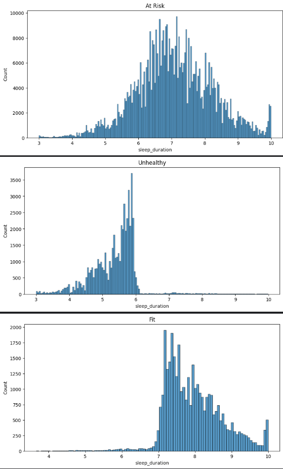

# Predicting-Student-Health-Risk-Kaggle
My attempts and work for season 6 episode 7 of the Kaggle Playground series (https://www.kaggle.com/competitions/playground-series-s6e7)

## Log
|Model/Change|CV (Balanced Accuracy)|Public Leaderboard|
|---|---|---|
|Baseline LGBM Model|0.94965|Score: 0.94995|

## Feature Engineering 
The first thing I did for feature engineering was I wrote a script to plot my target variable (health condition) against all of my features, specifically numerical features to look for patterns.
Using the feature_distribution notebook I genered 3 graphs per feature, one for each category in target (at-risk, unhealthy, and fit) and after looking at them I tried to find patterns and ideas for new features.
The main pattern I found was in sleep duration as there seemed to a huge difference in distrubtions between the three categories as shown in the images below.

